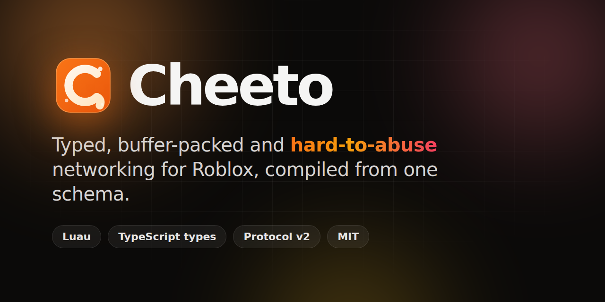

<div align="center">

<a href="https://pealz.cc/cheeto">
  
</a>

<br>
<br>

[](https://github.com/pealz1/cheeto/actions/workflows/ci.yml)
[](https://github.com/pealz1/cheeto/releases/latest)
[](https://pealz.cc/cheeto)
[](LICENSE)
[](https://luau.org)

**[Documentation](https://pealz.cc/cheeto)** ·
**[Quick start](https://pealz.cc/cheeto/getting-started/quick-start)** ·
**[Reference](https://pealz.cc/cheeto/reference)** ·
**[Releases](https://github.com/pealz1/cheeto/releases)**

</div>

---

Cheeto is a compiler for Roblox networking. You describe your events, functions and state in a small schema language, and Cheeto generates the Luau modules that send and receive them: buffer-packed, fully typed on both sides, and guarded by validation, rate limits and your own policies before your code ever runs.

```cheeto
option ClientOutput = "Network/Client.luau"
option ServerOutput = "Network/Server.luau"

struct Hit {
    Target: Instance(Player),
    Damage: u16(0..500)
}

event DealDamage {
    From: Client,
    Type: Reliable,
    Call: SingleAsync,
    Policy: "damage",
    CooldownSeconds: 0.25,
    Data: Hit
}
```

```lua
-- Server
local Network = require(ReplicatedStorage.Network.Server)

Network.Security.RegisterPolicy("damage", function(context)
    return context.Source.Character ~= nil, "no-character"
end)

Network.DealDamage.On(function(player, hit)
    Combat.Apply(player, hit.Target, hit.Damage)
end)
```

```lua
-- Client
local Network = require(ReplicatedStorage.Network.Client)

Network.DealDamage.Fire({ Target = target, Damage = 25 })
```

Checking `Damage` against `0..500`, enforcing the cooldown, running the policy and rejecting malformed packets all happen in generated code. Anything that does not match the schema is dropped before it reaches yours.

## Features

**Fast by construction**
- Every field is written at its declared width. Integers are varint-encoded, booleans bit-pack, and reliable and unreliable events are batched into one remote call per recipient per frame.
- 30+ Roblox datatypes with purpose-built encodings, including `CFrame`, `Color3`, `UDim2`, `NumberSequence`, `Font` and `EnumItem`.
- `Latest` and `Sequenced` delivery for high-frequency state, reliable fragmentation and priority-based shedding.
- `--benchmark` measures the bytes, encode and decode time of every endpoint in your schema.

**Typed end to end**
- Generated Luau types for the client and the server, with full autocomplete.
- TypeScript definitions for roblox-ts projects, covering every endpoint and the runtime API, checked with `tsc --strict`.
- Structs, enums, tagged enums, maps, sets, optionals, generics and imports.

**Hard to abuse**
- Size caps, decode budgets and payload canonicalization drop malformed data before a listener runs.
- Per-event policies, auth rules, rate limits, cooldowns and idempotency, all failing closed when a rule is missing.
- Constraints the runtime enforces: distance, ownership, team, zone, match, character state, handles and server-issued ids.
- Honeypot endpoints, kill switches, replay protection, and a schema-fingerprint handshake that stops decoding mismatched clients.
- Dropped calls and predictions are answered with the reason, so `Invoke` never hangs on a rejection.
- `SecurityPreset = Maximum` adds a client shield, integrity challenges, server-side movement checks, rotating remote names and decoy remotes.

**Built for production**
- `--doctor`, `--strict` and `--hardening-checklist` catch unsafe configuration before release.
- `cheeto.lock` keeps endpoint ids stable across edits and turns every wire change into a reviewed diff.
- Packet capture and replay, metrics and an inspector.
- State channels with delta replication, and client prediction with server acknowledgement.

**Fits your workflow**
- A single binary for Windows, macOS and Linux, a pesde package, and a Roblox Studio plugin.
- Watch mode recompiles whenever a schema or one of its imports changes.

## Installation

With [Rokit](https://github.com/rojo-rbx/rokit) (recommended):

```sh
rokit add pealz1/cheeto
```

With [pesde](https://pesde.dev):

```sh
pesde add --dev pealz1/cheeto
```

Or download a binary or the Studio plugin from the [latest release](https://github.com/pealz1/cheeto/releases/latest).

## Usage

```sh
cheeto network            # compile network.cheeto
cheeto network --watch    # recompile on every change
cheeto network --doctor   # validate without writing files
cheeto network --ci --yes # run every report and lockfile check
```

`cheeto --help` lists every option. The [command line reference](https://pealz.cc/cheeto/reference/cli) covers every flag.

## Security model

No networking library can hide data from the client that receives it, and Cheeto does not pretend to. Instead it keeps authority on the server: every client request is checked against the schema, your policies and its rate limits before a handler runs, and every drop is reported through `Security.OnViolation` with a typed reason you can act on.

Read the [security model](https://pealz.cc/cheeto/security/overview) and the [limitations](https://pealz.cc/cheeto/limitations), and [SECURITY.md](SECURITY.md) to report a vulnerability.

## Documentation

| | |
| --- | --- |
| [Installation](https://pealz.cc/cheeto/getting-started/installation) | Every way to install the compiler and the plugin |
| [Quick start](https://pealz.cc/cheeto/getting-started/quick-start) | Your first schema in five minutes |
| [Reference](https://pealz.cc/cheeto/reference) | Every option, field, type and generated function |
| [Security model](https://pealz.cc/cheeto/security/overview) | Policies, honeypots, rate limits and the optional client checks |
| [Production checklist](https://pealz.cc/cheeto/operations/production-checklist) | What to check before a schema goes live |
| [Limitations](https://pealz.cc/cheeto/limitations) | What Cheeto does not do, and where its checks stop |
| [Comparison](https://pealz.cc/cheeto/guides/comparison) | How Cheeto relates to Zap |

## Repository layout

```text
src/         the compiler: lexer, parser, generator and CLI
plugin/      the Roblox Studio plugin
extras/      optional standalone security detectors
test/        the test suite and schema fixtures
benchmark/   the in-Studio benchmark harness
docs/        the documentation site
```

## Contributing

Contributions are welcome. Read [CONTRIBUTING.md](CONTRIBUTING.md) to get set up, and follow the [code of conduct](CODE_OF_CONDUCT.md). In short:

```sh
rokit install
cd test && lune run Test --ci
```

## Contributors

<!-- ALL-CONTRIBUTORS-LIST:START - Do not remove or modify this section -->
<table>
  <tbody>
    <tr>
      <td align="center" valign="top" width="25%"><a href="https://github.com/pealz1"><br /><sub><b>pealz1</b></sub></a><br />Maintainer</td>
      <td align="center" valign="top" width="25%"><a href="https://github.com/1Axen"><br /><sub><b>1Axen</b></sub></a><br />Original compiler</td>
      <td align="center" valign="top" width="25%"><a href="https://github.com/ArvidSilverlock"><br /><sub><b>ArvidSilverlock</b></sub></a><br />float16 encoding</td>
    </tr>
  </tbody>
</table>
<!-- ALL-CONTRIBUTORS-LIST:END -->

Want to see your name here? Pick up an issue and open a pull request.

## Acknowledgements

- Cheeto's compiler core is derived from MIT-licensed work by [1Axen](https://github.com/1Axen).
- The range and array syntax is inspired by [Zap](https://zap.redblox.dev).
- The float16 implementation is by [ArvidSilverlock](https://github.com/ArvidSilverlock).
- The syntax grammar and code theme under `docs/public/syntax` are MIT licensed by Tijn Epema and checkraisefold.
- Studio plugin autocomplete icons come from [vscode-icons](https://github.com/microsoft/vscode-icons) by Microsoft, licensed under [CC BY 4.0](https://github.com/microsoft/vscode-icons/blob/main/LICENSE). <a href="https://www.flaticon.com/free-icons/speed" title="speed icons">Speed icons created by alkhalifi design - Flaticon</a>.

## License

Cheeto is released under the [MIT License](LICENSE).
